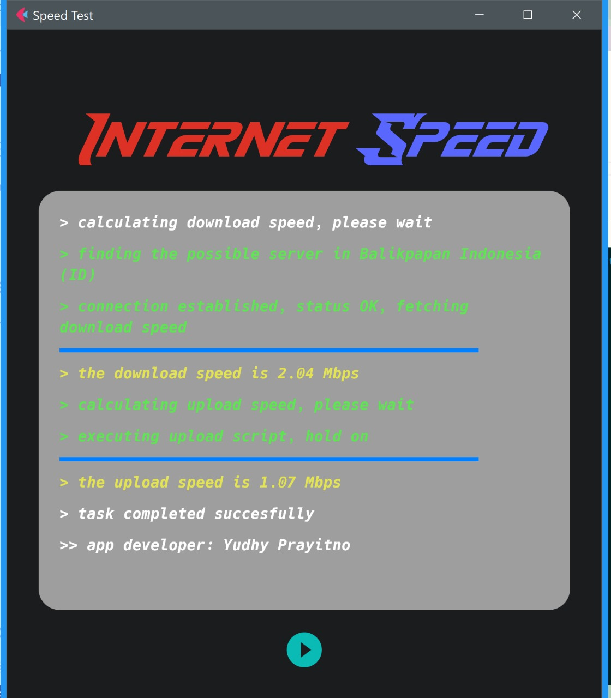

# Check Internet Speed 🌐💨

This Flutter application allows you to stylishly check your internet speed. It utilizes the Speedtest library to measure your download and upload speeds.



## Required Modules 📦

You'll need to install a few modules to run this application. You can install them using `pub`.

- `flet`: This library is used to create attractive and responsive Flutter interfaces.
- `speedtest`: This library is used to measure internet speed.

You can install these modules with the following command:
pip install flet
pip install speedtest-cli
```bash
pub get
How to Use 🚀
Clone this repository to your computer.
Open the project using Flutter.
Run the application on your device or emulator.
Contribution 💪
If you'd like to contribute to this project, please create a pull request, and we'll gladly review it.

License 📄
This project is licensed under the MIT License - see the LICENSE.md file for more details.

Developer Contact 📧
If you have any questions or feedback, feel free to contact the developer:

👤 Yudhy Prayitno
✉️ yudhyprayitno567@gmail.com

Thank you for using this application! We hope it's helpful for you. Happy coding! 🎉

